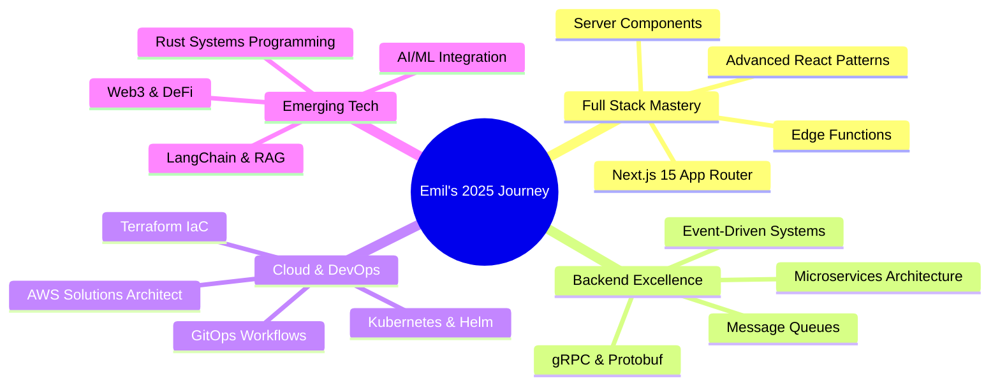

<div align="center">

<!-- Animated Wave Hand -->
 
<b>Welcome to my digital playground!</b>


<br/>


<br/>

<!-- Animated Social Links -->
<a href="https://linkedin.com/in/emilsaji/">
  
</a>
<a href="https://x.com/the_contender_">
  
</a>
<a href="mailto:emilsaji123@gmail.com">
  
</a>
<a href="#">
  
</a>
<a href="https://discord.com/users/yourid">
  
</a>

<br/><br/>


</div>

<!-- Snake Animation -->
<div align="center">
  <picture>
    <source media="(prefers-color-scheme: dark)" srcset="https://raw.githubusercontent.com/platane/snk/output/github-contribution-grid-snake-dark.svg" />
    <source media="(prefers-color-scheme: light)" srcset="https://raw.githubusercontent.com/platane/snk/output/github-contribution-grid-snake.svg" />
    
  </picture>
</div>

---

##  About Me

```typescript
const emil: Developer = {
    pronouns: "he" | "him",
    title: "Full Stack Developer & System Architect",
    location: "Kerala, India 🇮🇳",
    education: {
        degree: "BTech in Computer Science",
        institution: "Providence College of Engineering",
        status: "Graduated with passion for building things"
    },
    experience: "2+ years crafting web experiences & backend systems",
    currentlyBuilding: "Scalable solutions that make a difference",
    askMeAbout: ["Web Dev", "Backend", "System Design", "Web3", "DevOps"],
    techCommunities: {
        contributor: ["Open Source Projects", "Stack Overflow"],
        learning: ["System Design", "Cloud Architecture", "AI/ML"]
    },
    challenge: "I'm aiming to contribute to 100 open source projects in 2025",
    funFact: "I debug with console.log and I'm proud of it! 😄"
};
```

<table>
<tr>
<td width="50%">

### 🎯 What I'm Up To

- 🔭 Working on **scalable microservices architecture**
- 🌱 Learning **Kubernetes & Cloud Native Development**
- 👯 Looking to collaborate on **Web3 projects**
- 🤔 Exploring **AI integration in web apps**
- 💬 Ask me about **anything tech-related**
- ⚡ Fun fact: Best code is the code you don't write!

</td>
<td width="100%">

</td>
</tr>
</table>

---

##  Tech Arsenal

<div align="center">

### 🎨 Frontend Development


### ⚙️ Backend Development


### 🗄️ Databases & Cloud


### 🛠️ Tools & DevOps


</div>

<!-- Tech Stack Progress Bars -->
<details>
<summary><b>📊 Detailed Tech Proficiency</b></summary>
<br/>

```text
JavaScript/TypeScript   ████████████████████░░░░░   85%
React/Next.js           ████████████████████░░░░░   82%
Node.js/Express         ███████████████████░░░░░░   78%
Java/Spring Boot        ████████████████░░░░░░░░░   68%
Rust                    ███████████░░░░░░░░░░░░░░   48%
DevOps/Cloud            ███████████████░░░░░░░░░░   62%
Web3/Solidity           ██████████████░░░░░░░░░░░   58%
System Design           █████████████████░░░░░░░░   70%
```

</details>

---

##  GitHub Analytics

<div align="center">
  
  
</div>

<div align="center">
  
  
</div>

<div align="center">
  
</div>

---

## 🏆 GitHub Trophies

<div align="center">
  
[](https://github.com/ryo-ma/github-profile-trophy)

</div>

---

## ⏱️ Weekly Coding Stats

<!--START_SECTION:waka-->
```text
TypeScript   12 hrs 30 mins  ██████████████░░░░░░░  45.2%
JavaScript   6 hrs 15 mins   ███████░░░░░░░░░░░░░░  22.6%
Rust         4 hrs 20 mins   █████░░░░░░░░░░░░░░░░  15.7%
Java         2 hrs 45 mins   ███░░░░░░░░░░░░░░░░░░   9.9%
JSON         1 hr 10 mins    █░░░░░░░░░░░░░░░░░░░░   4.2%
Other        38 mins         ░░░░░░░░░░░░░░░░░░░░░   2.4%
```
<!--END_SECTION:waka-->

> 💡 *To enable real-time stats, set up [WakaTime](https://wakatime.com/) and [waka-readme](https://github.com/athul/waka-readme)*

---

## 🎯 Current Focus & Roadmap



---

## 🎵 Vibing To

<div align="center">

[](https://github.com/kittinan/spotify-github-profile)

> 💡 *Replace YOUR_SPOTIFY_ID with your actual Spotify user ID to enable this feature*

</div>

---

## 📈 Contribution Activity

<div align="center">


</div>

---

## 🚀 Featured Projects

<div align="center">

<a href="https://github.com/EmilSaji/your-awesome-project">
  
</a>
<a href="https://github.com/EmilSaji/another-cool-project">
  
</a>

</div>

<br/>

<details>
<summary><b>🏗️ Project Showcase Details</b></summary>
<br/>

| Project | Description | Tech Stack | Status |
|---------|-------------|------------|--------|
| 🔥 **Project Alpha** | A scalable microservices platform | `Node.js` `Docker` `K8s` | 🟢 Active |
| 🌐 **Web3 DApp** | Decentralized application for NFTs | `Solidity` `React` `Web3.js` | 🟡 In Progress |
| 📱 **Mobile App** | Cross-platform fitness tracker | `React Native` `Firebase` | 🟢 Active |
| 🤖 **AI Assistant** | Personal productivity chatbot | `Python` `LangChain` `OpenAI` | 🔵 Planning |

</details>

---

## 💡 Random Dev Quote

<div align="center">


</div>

---

## 📖 Latest Blog Posts

<!-- BLOG-POST-LIST:START -->
- 🔥 [Building Scalable Microservices with Node.js and Docker](#)
- 🌐 [Getting Started with Web3 Development: A Complete Guide](#)
- ⚡ [Performance Optimization Tips for React Applications](#)
- 🔧 [Rust for JavaScript Developers: The Complete Transition Guide](#)
- 🚀 [CI/CD Best Practices for Modern Web Applications](#)
<!-- BLOG-POST-LIST:END -->

> 💡 *Connect [blog-post-workflow](https://github.com/gautamkrishnar/blog-post-workflow) to auto-update this section*

---

## 🎮 When I'm Not Coding

<table>
<tr>
<td width="50%">

```javascript
class EmilOffline {
    constructor() {
        this.hobbies = [
            '📚 Reading Tech Blogs',
            '🎮 Gaming Sessions',
            '🎵 Music & Podcasts',
            '🏋️ Fitness & Health',
            '✈️ Travel & Explore'
        ];
        this.currentlyReading = 
            'Designing Data-Intensive Applications';
        this.nextOnList = 
            'System Design Interview Vol. 2';
    }
    
    getLifePhilosophy() {
        return "Balance is key: Work hard, play harder!";
    }
}
```

</td>
<td width="50%">

### 📚 Currently Reading


**Designing Data-Intensive Applications**  
*by Martin Kleppmann*

The comprehensive guide to understanding distributed systems and building reliable, scalable applications.

<br clear="left"/>

### 🎯 2025 Goals
- [ ] Contribute to 50+ open source projects
- [ ] Launch a SaaS product
- [ ] Get AWS Solutions Architect certified
- [ ] Write 12 technical blog posts

</td>
</tr>
</table>

---

## 🤝 Let's Connect and Collaborate!

<div align="center">

 
<br/>
<em><b>I love connecting with fellow developers!</b> If you want to say <b>hi, I'll be happy to meet you!</b> 😊</em>

<br/><br/>

### 💬 Ways to Reach Me

<a href="https://linkedin.com/in/emilsaji/">
  
</a>
<a href="https://x.com/the_contender_">
  
</a>
<a href="mailto:emilsaji123@gmail.com">
  
</a>
<a href="https://discord.com/users/yourid">
  
</a>

<br/><br/>

**💬 Ask me about:** Web Development, Backend Architecture, System Design, Web3, or anything tech!

**📫 Email:** [emilsaji123@gmail.com](mailto:emilsaji123@gmail.com)

**⚡ Pro tip:** Star the repos you find interesting - it really motivates developers! ⭐

</div>

---

## 📊 This Week I Spent My Time On

<!--RECENT_ACTIVITY:start-->
```text
💻 Development     ████████████████░░░░  80%
📖 Learning        ████░░░░░░░░░░░░░░░░  12%
📝 Documentation   ██░░░░░░░░░░░░░░░░░░   8%
```
<!--RECENT_ACTIVITY:end-->

---

<div align="center">

### ⭐ Star This Repository If You Found It Helpful!

<a href="https://www.buymeacoffee.com/emilsaji">
  
</a>

<br/><br/>


<br/>


</div>

<!-- Secret: If you're reading this, you're awesome! 🎉 -->
<!-- Profile last updated: December 2024 -->
