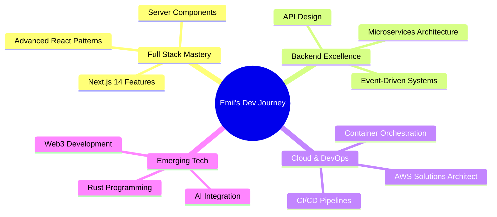

<div align="center">

# 👋 Hi, I'm Emil Saji


[](https://linkedin.com/in/emilsaji/)
[](https://x.com/the_contender_)
[](mailto:emilsaji123@gmail.com)
[](#)


</div>

---

## 🚀 About Me

```typescript
const emil = {
    title: "Full Stack Developer",
    location: "Kerala, India 🇮🇳",
    education: "BTech in Computer Science - Providence College of Engineering",
    experience: "2+ years in web development & backend architecture",
    currentFocus: ["Scalable Systems", "Cloud Architecture", "Web3 Technologies"],
    lifePhilosophy: "Code with purpose, build with passion, learn continuously",
    funFact: "I debug with console.log and I'm not ashamed! 😄"
};
```

<details open>
<summary><b>🎯 What I Do</b></summary>
<br/>

- 🔨 Building **user-friendly, secure, and scalable** web applications
- ⚡ Architecting **robust backend systems** with focus on performance
- 🎓 Passionate about **educational technology** and empowering educators
- 🌱 Constantly exploring new technologies and best practices
- 🤝 Collaborating with teams to deliver **high-quality products**

</details>

---

## 💻 Tech Arsenal

<div align="center">

### 🎨 Frontend Development


### ⚙️ Backend Development


### 🗄️ Databases & Cloud


### 🛠️ Tools & DevOps


</div>

---

## 📊 GitHub Analytics

<div align="center">
  
  
</div>

<div align="center">
  
  
</div>

---

## 🏆 GitHub Trophies

<div align="center">
  
[](https://github.com/ryo-ma/github-profile-trophy)

</div>

---

## 🎯 Current Focus



---

## 📈 Contribution Activity

<div align="center">


</div>

---

## 🎨 Projects & Contributions

<div align="center">

<!-- Add your pinned repos here as they will show automatically on your profile -->
<!-- But you can also create custom cards like this: -->

<a href="https://github.com/EmilSaji/your-awesome-project">
  
</a>
<a href="https://github.com/EmilSaji/another-cool-project">
  
</a>

</div>

---

## 💡 Random Dev Quote

<div align="center">


</div>

---

## 🎮 When I'm Not Coding

```javascript
class EmilOffline {
    constructor() {
        this.hobbies = ['Reading Tech Blogs', 'Contributing to Open Source', 'Learning New Technologies'];
        this.currentlyReading = 'System Design Interview by Alex Xu';
        this.nextToLearn = 'Kubernetes & Cloud Native Development';
    }
    
    stayMotivated() {
        return "Every line of code is a step towards mastery! 🚀";
    }
}
```

---

## 🤝 Let's Connect and Collaborate!

<div align="center">

I'm always open to interesting conversations and collaboration opportunities!

**💬 Ask me about:** Web Development, Backend Architecture, Database Design, or anything tech!

**📫 Best way to reach me:** [emilsaji123@gmail.com](mailto:emilsaji123@gmail.com)

**⚡ Fun fact:** I believe the best code is the code you don't have to write!

---

### Show some ❤️ by starring repositories you find interesting!


</div>
